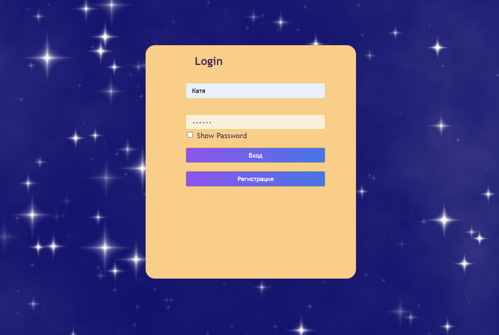
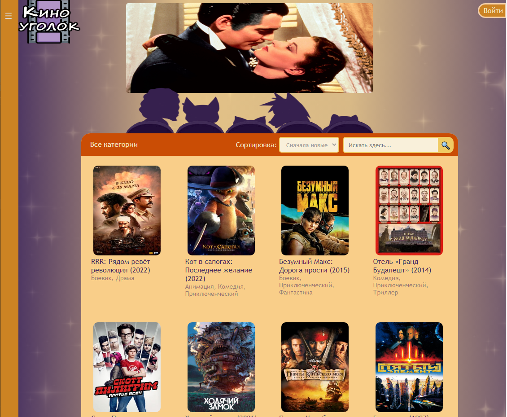
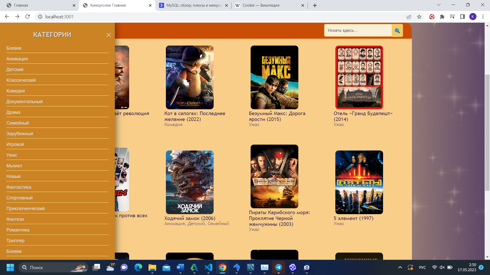
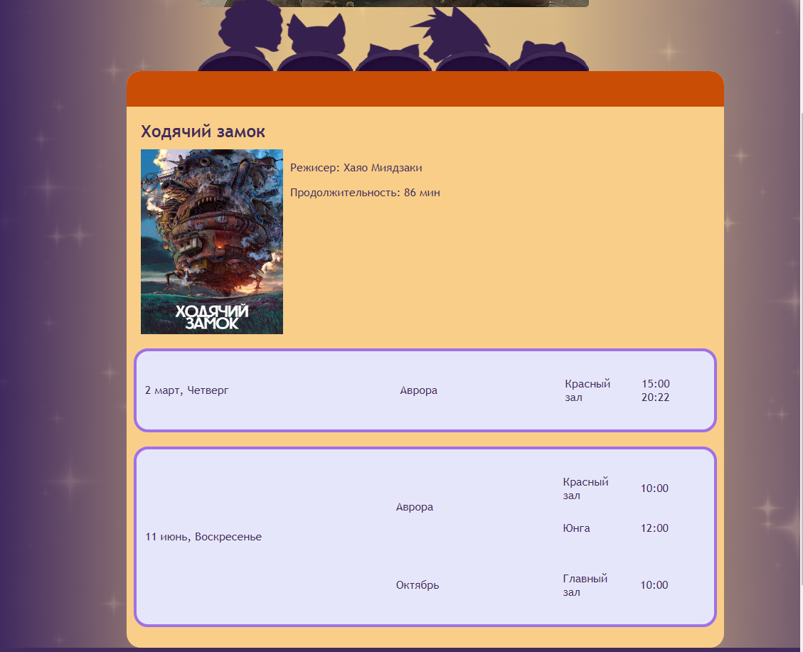
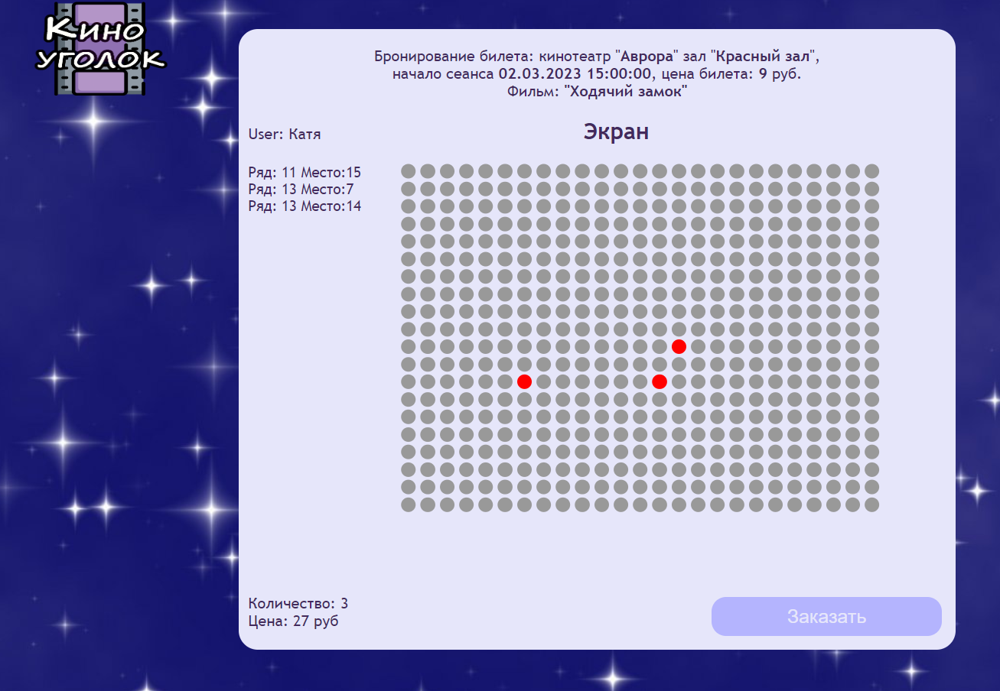
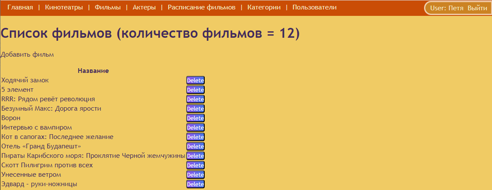

# Cinema web-application
The application for online booking tickets to the cinema that allows viewers to log in, viewing information about films, sessions schedule and choosing places for reservation, as well as providing administrator tools for controlling content and interface.
### Authorization
When trying to go to order tickets, a page with authorization meets. Next is the login and password.

### Main page
The main page features films that are currently in theaters.

### Pull-down menu on the left
The pull-down menu on the left shows the main genres and categories of films

### Single movie page
The page for an individual film provides basic information about the film: title, genres, director, actors, duration, stills from the film and a brief description

### Movie schedule
The schedule contains information about the time, date, cinema and hall.

### Seat selection page
On this page you can choose a seat, the empty seats are marked with green circles, and the occupied seats are marked with red circles. At the top there is information about the session and the ticket price. On the left is the user name and a list of the seats occupied by him, their number and the total amount to be paid.

### Administrator interface
The administrator can add all the necessary information related to the films.

